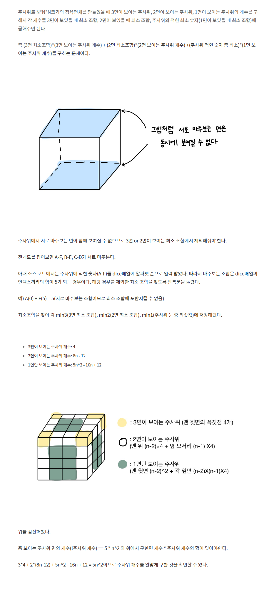

## 주사위 1041
### 분석

### 소스코드 Python
```python
n = int(input())
dice = list(map(int, input().split()))


if n == 1:
    print(sum(dice)-max(dice))

dice = [min(dice[0], dice[5]),
               min(dice[1], dice[4]),
               min(dice[2], dice[3])]
dice.sort()

result = dice[-1] * 4
result += (8 * (n - 1)) * dice[1]
result += (n * n * 5 - ((8 * (n - 1)) + 4)) * dice[0]

print(result)
```
